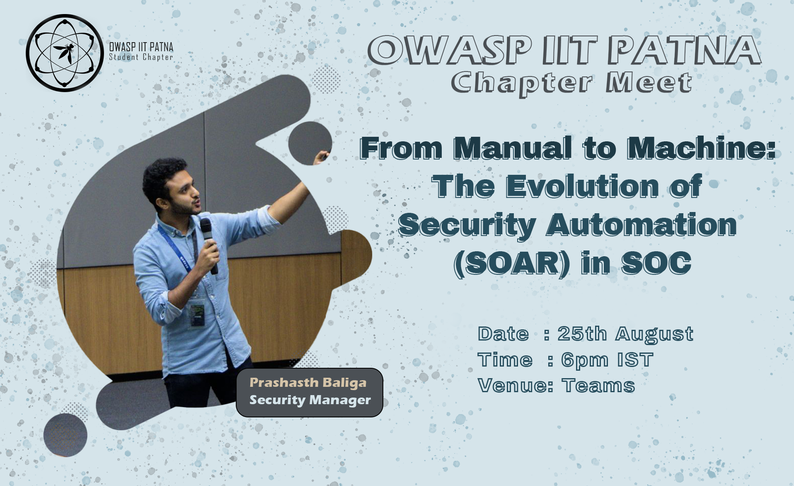
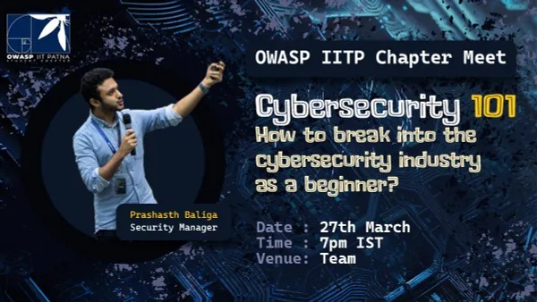

## Past Events

### Industry based Security Testing
The cybersecurity session provides a comprehensive overview of industry security testing, emphasizing key principles, testing types, regulatory compliance, and industry-specific challenges. It delves into the security testing process, highlighting automation's benefits and showcasing real-world examples for practical insights. The session encourages audience interaction through a Q&A session and concludes by summarizing the key takeaways in ensuring robust cybersecurity measures. Overall, it equips participants with essential knowledge and tools to address evolving cybersecurity threats effectively.

- Speaker : Tapan Kr. Jha
- Certificate ID: `CM17022024`
- [Recording](https://cciitpatna-my.sharepoint.com/:v:/g/personal/owasp_iitp_ac_in/EV9BoMRUWXZAoUj7OUoRAd8Bk6ca2rke1bglOmYQeWvuAA?e=tAiHiH)
```
With the expertise of 13 years in the field of ethical hacking, network security, vulnerability assessment & penetration testing, computer forensic, server security, I have provided professional services & training. In more than 30 Indian, US MNC’s. for being one of the best in field, I have been recognized under India’s Top 10 cyber forensic solution provide 2019 & 2nd Rank on India’s Top 10 VAPT Solution Provider by Silicon India Magazine.
```


### From Manual to Machine: The Evolution of Security Automation (SOAR) in SOC
Discover the game-changing potential of Security Orchestration, Automation, and Response (SOAR) in revolutionizing cybersecurity. This talk dives into how SOAR turbocharges incident response by automating tasks, coordinating tools, and amplifying team efficiency. We will explore real-world use cases, benefits, and best practices for integrating SOAR seamlessly. By the end, you'll grasp how SOAR empowers organizations to combat threats proactively, minimize manual effort, and fortify their security posture.

- [Recording](https://cciitpatna-my.sharepoint.com/:v:/g/personal/owasp_iitp_ac_in/ES7z9EwzNDtJlTkp8FQXS1EBEHZBnWxWThBW4ZzxZmivCA)
- Speaker : Prashasth Baliga
- Certificate ID: `CM25082023`
```
As a Security Manager at Palo Alto Networks based in Singapore, I specialize in security automation and lead a global team of cybersecurity consultants and a security evangelist. My experience includes working for renowned cybersecurity companies such as RSA Security and Cisco, where I held positions as a penetration tester and security developer. Outside of my professional role, I am deeply passionate about giving back to the security community through speaking engagements at various events and conferences across Asia and Africa, as well as mentoring programs for students, to enter the cyber industry
```


--- 
### Cybersecurity 101 - How to break into the cybersecurity industry as a beginner?
This talk will provide an introduction to cybersecurity for beginners and offer guidance on how to break into the cyberindustry. The speaker will provide practical advice on how to gain relevant experience, including resources for learning and developing technical skills, as well as tips for building a professional network and finding job opportunities. The talk will also touch on the importance of staying current with industry trends and regulations, and the need for ethical behavior and responsibility in the cybersecurity profession.


- [Recording](https://youtu.be/dbBqUus3ijk)
- Speaker : Prashasth Baliga
```
As a Security Manager at Palo Alto Networks based in Singapore, I specialize in security automation and lead a global team of cybersecurity consultants and a security evangelist. My experience includes working for renowned cybersecurity companies such as RSA Security and Cisco, where I held positions as a penetration tester and security developer. Outside of my professional role, I am deeply passionate about giving back to the security community through speaking engagements at various events and conferences across Asia and Africa, as well as mentoring programs for students, to enter the cyber industry
```



---
### NMAP : Scanning Network Like a Boss
Join cybersecurity expert Krishnan S N as he takes you on a thrilling journey into the world of network scanning. Discover the power of Nmap and how it can revolutionize the way you approach network security. Learn from the best as Krishnan shares his knowledge, tips, and tricks to help you become a Nmap master. Whether you are a seasoned network professional or a beginner, this session is guaranteed to spark your curiosity and leave you eager to learn more. So, come prepared to have your mind blown and get ready to scan networks like a boss with Nmap.

Join us on 15th Feb at [teams](https://teams.microsoft.com/l/meetup-join/19%3ameeting_ZTJkMDk2NjktNWU4Yi00MWE4LWE0NmMtMTcwYjFkNTlmYmY4%40thread.v2/0?context=%7b%22Tid%22%3a%22a57f7d92-038e-4d4c-8265-7cd2beb33b34%22%2c%22Oid%22%3a%229b130259-1893-4364-bf5d-bd96d925ad0b%22%7d)


---
### Intro to CTFS

**Date:** 20th June 2021

A beginner-friendly session to introduce Capture the flag events (CTFs), its variants and categories with fun challenges and examples among other interesting things you should definitely know.

**[Slides](https://njack-iitp.github.io/cybersecurity/intro-to-ctfs.html)**


