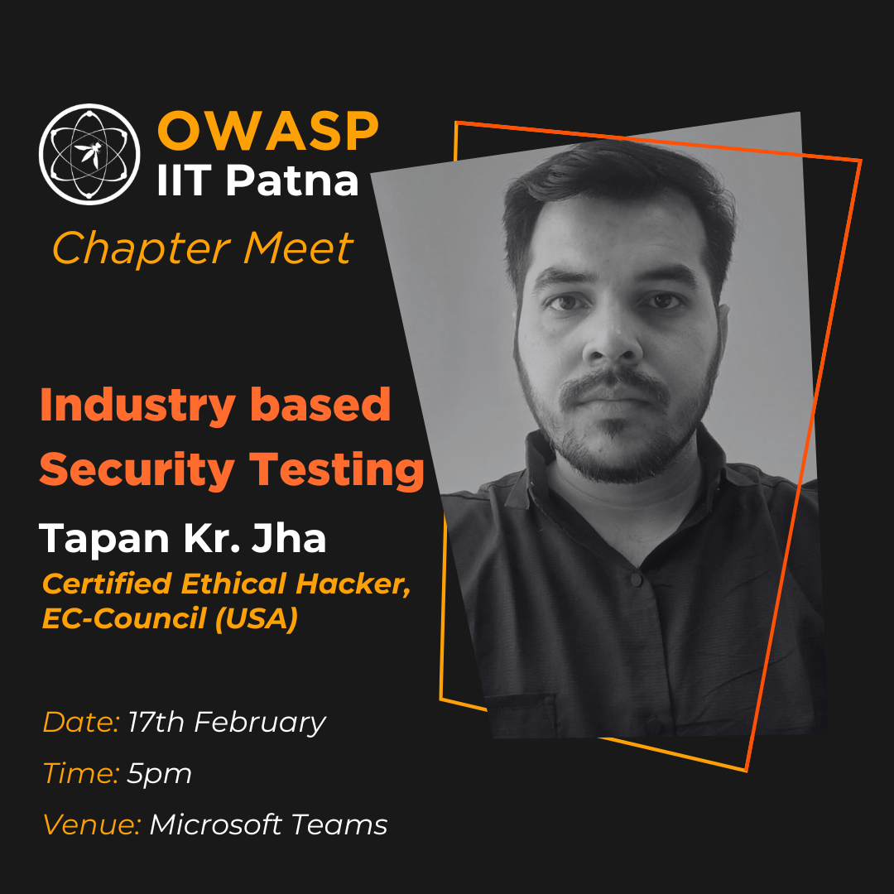

## Upcoming Events



### Industry based Security Testing
The cybersecurity session provides a comprehensive overview of industry security testing, emphasizing key principles, testing types, regulatory compliance, and industry-specific challenges. It delves into the security testing process, highlighting automation's benefits and showcasing real-world examples for practical insights. The session encourages audience interaction through a Q&A session and concludes by summarizing the key takeaways in ensuring robust cybersecurity measures. Overall, it equips participants with essential knowledge and tools to address evolving cybersecurity threats effectively.

- Speaker : Tapan Kr. Jha
```
With the expertise of 13 years in the field of ethical hacking, network security, vulnerability assessment & penetration testing, computer forensic, server security, I have provided professional services & training. In more than 30 Indian, US MNC’s. for being one of the best in field, I have been recognized under India’s Top 10 cyber forensic solution provide 2019 & 2nd Rank on India’s Top 10 VAPT Solution Provider by Silicon India Magazine.
```

